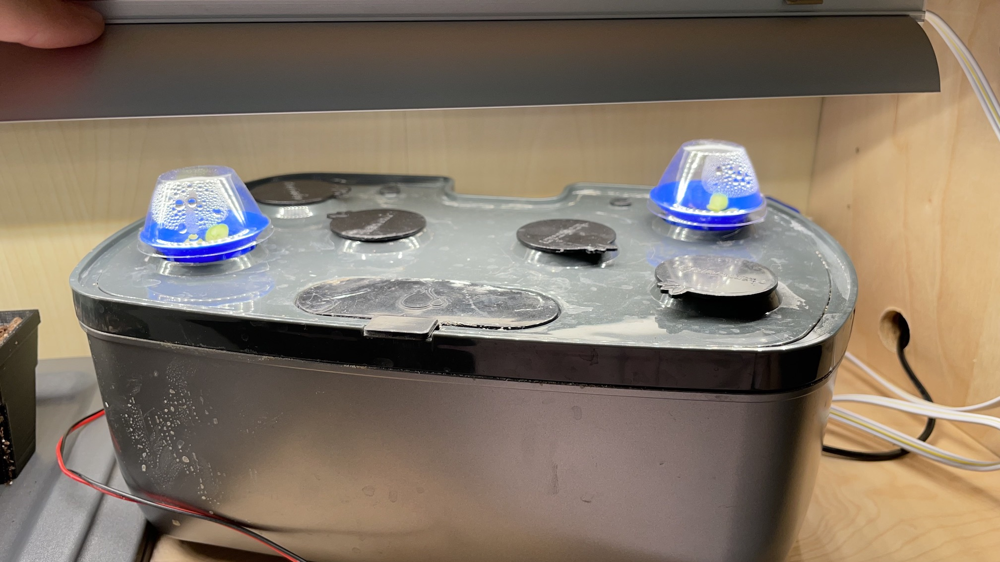
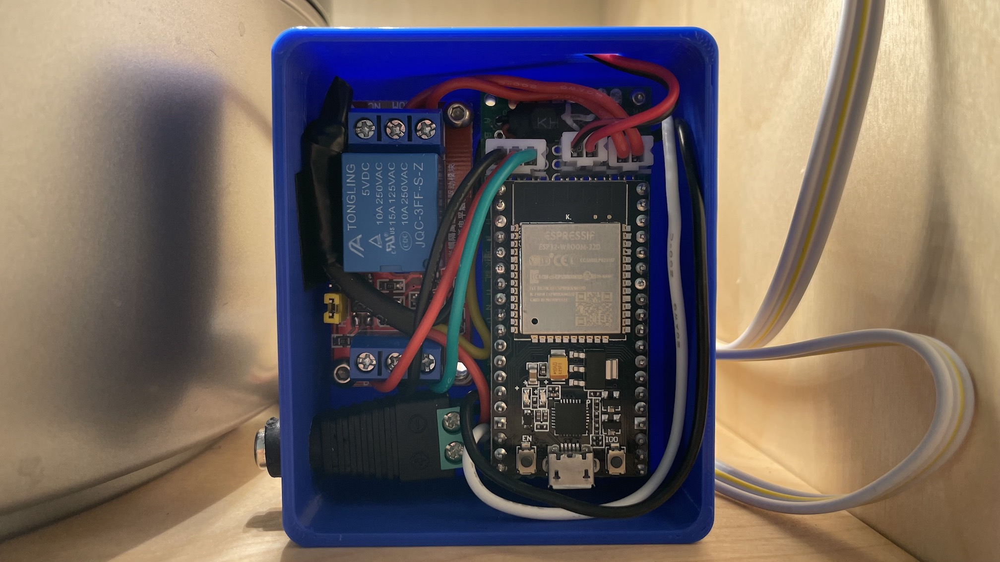

# Hydroponics Example

## Details
This is a simple hydroponics setup built from parts of an Aerogarden that I found at a thrift store. It didn't have the built-in light and the pump was broken. I replaced the pump with a 12V DC fountain pump and hooked that up to a single relay.

This Garden has just one Plant that circulates the water with the pump for 5 minutes in every hour.

## Components

### Purchased
- Water pump
- Relay
- Power adapter
- Circuit board
- ESP32 dev board
- 12V -> 5V converter

### 3D Printed
- Electronics cases

### Circuit
This has a very basic setup since it just consists of the ESP32 and a single relay. A 12V power supply is plugged in and the power goes to a 5V converter and to the relay.

## Configurations
<!-- tabs:start -->
#### **`garden-controller/config.h`**
```c
#ifndef config_h
#define config_h

#define GARDEN_NAME "aerogarden"

#define QUEUE_SIZE 10

#define ENABLE_WIFI
#ifdef ENABLE_WIFI
#define MQTT_ADDRESS "192.168.0.107"
#define MQTT_PORT 30002
#define MQTT_CLIENT_NAME GARDEN_NAME
#define MQTT_WATER_TOPIC GARDEN_NAME"/command/water"
#define MQTT_STOP_TOPIC GARDEN_NAME"/command/stop"
#define MQTT_STOP_ALL_TOPIC GARDEN_NAME"/command/stop_all"
#define MQTT_LIGHT_TOPIC GARDEN_NAME"/command/light"
#define MQTT_LIGHT_DATA_TOPIC GARDEN_NAME"/data/light"
#define MQTT_WATER_DATA_TOPIC GARDEN_NAME"/data/water"

#define ENABLE_MQTT_HEALTH
#ifdef ENABLE_MQTT_HEALTH
#define MQTT_HEALTH_DATA_TOPIC GARDEN_NAME"/data/health"
#define HEALTH_PUBLISH_INTERVAL 60000
#endif

#define ENABLE_MQTT_LOGGING
#ifdef ENABLE_MQTT_LOGGING
#define MQTT_LOGGING_TOPIC GARDEN_NAME"/data/logs"
#endif

#define JSON_CAPACITY 48
#endif

#define NUM_PLANTS 1
#define PLANTS { { GPIO_NUM_18, GPIO_NUM_16, GPIO_NUM_19, GPIO_NUM_36 } }
#define DEFAULT_WATER_TIME 5000

#endif
```

#### **`garden-app/config.yaml`**
```yaml
web_server:
  port: 80
mqtt:
  broker: "mosquitto"
  port: 1883
  client_id: "garden-app"
  watering_topic: "{{.Garden}}/command/water"
  skip_topic: "{{.Garden}}/command/skip"
  stop_topic: "{{.Garden}}/command/stop"
  stop_all_topic: "{{.Garden}}/command/stop_all"
  light_topic: "{{.Garden}}/command/light"
influxdb:
  address: "http://influxdb:8086"
  token: "my-secret-token"
  org: "garden"
  bucket: "garden"
storage:
  type: "ConfigMap"
  options:
    name: "garden-app-config"
    key: "gardens.yaml"
```

#### **Garden JSON**
```json
{
    "name": "aerogarden",
    "id": "c5ma39fphd1c514hk48g",
    "max_plants": 1,
    "created_at": "2021-10-13T02:55:13.046499731Z",
    "num_plants": 1,
    "plants": {
        "rel": "collection",
        "href": "/gardens/c5ma39fphd1c514hk48g/plants"
    },
    "links": [
        {
            "rel": "self",
            "href": "/gardens/c5ma39fphd1c514hk48g"
        },
        {
            "rel": "health",
            "href": "/gardens/c5ma39fphd1c514hk48g/health"
        },
        {
            "rel": "plants",
            "href": "/gardens/c5ma39fphd1c514hk48g/plants"
        },
        {
            "rel": "action",
            "href": "/gardens/c5ma39fphd1c514hk48g/action"
        }
    ]
}
```

#### **Plant JSON**
```json
{
    "name": "Tom Thumb Lettuce",
    "details": {
        "description": "Dwarf lettuce variety",
        "notes": "Grown in our thrifted aerogarden",
        "time_to_harvest": "70 days",
        "count": 2
    },
    "id": "c5maadvphd1ftefa6ok0",
    "garden_id": "c5ma39fphd1c514hk48g",
    "plant_position": 0,
    "created_at": "2021-10-17T22:35:35.205085596Z",
    "water_schedule": {
        "watering_amount": 300000,
        "interval": "1h",
        "start_time": "12:00:00-07:00"
    },
    "next_watering_time": "2021-11-24T19:00:00.000386496Z",
    "links": [
        {
            "rel": "self",
            "href": "/gardens/c5ma39fphd1c514hk48g/plants/c5maadvphd1ftefa6ok0"
        },
        {
            "rel": "garden",
            "href": "/gardens/c5ma39fphd1c514hk48g"
        },
        {
            "rel": "action",
            "href": "/gardens/c5ma39fphd1c514hk48g/plants/c5maadvphd1ftefa6ok0/action"
        },
        {
            "rel": "history",
            "href": "/gardens/c5ma39fphd1c514hk48g/plants/c5maadvphd1ftefa6ok0/history"
        }
    ]
}
```
<!-- tabs:end -->

## Images


