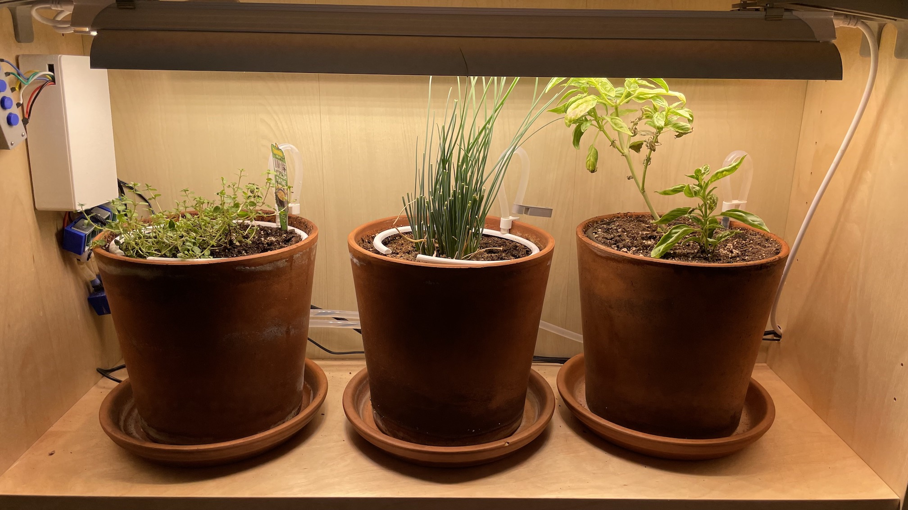
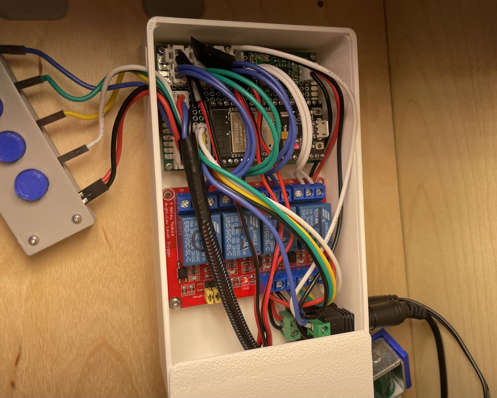
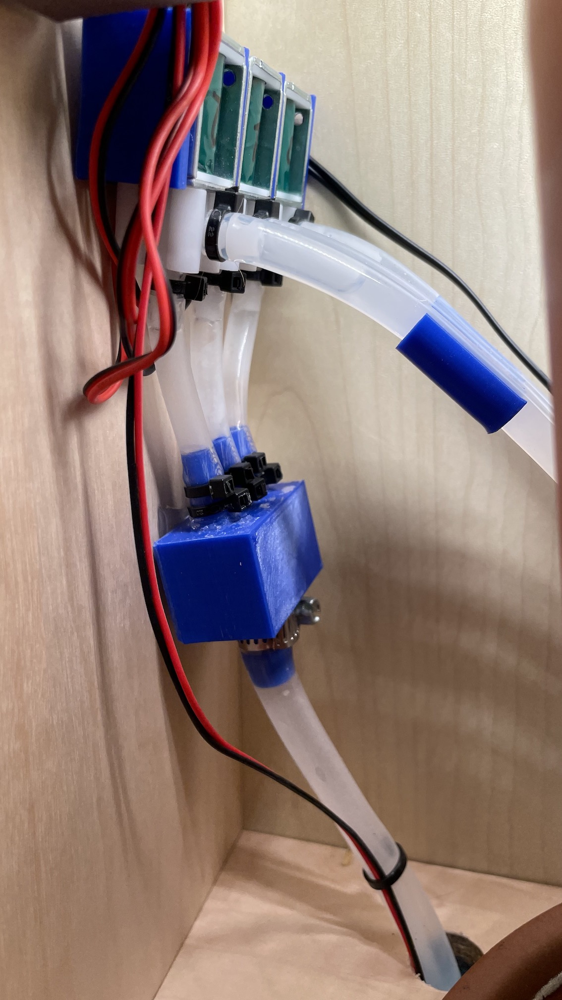

# Indoor Herb Garden Example

## Details
This is the first garden I setup with this. It consists of three small/medium pots and a grow light on a bookshelf. A 12V DC fountain pump moves water from a container at the base to a 3D printed splitter. The splitter delivers water to three 12V DC valves that route to a 3D printed watering ring on the pot.

This small garden has worked really well for growing herbs or even cherry tomatoes.

## Components

### Purchased
- Water pump
- Water valves/solenoids
- 8mm and 6mm Tubing
- Relays
- Grow lights
- Power adapter
- Circuit board
- ESP32 dev board
- 12V -> 5V converter

### 3D Printed
- Electronics case
- Buttons case
- Hose splitter
- Hose routing clips
- Grow light mounts

### Circuit
The circuitry for this setup is pretty straightforward. There is a 12V input that provides power to the 5V converter and the 4-channel relay. The 5V output is used to power the ESP32, the relay control, and the buttons. The 12V power is connected to four pairs of 2-pin JST connectors. Each pair has one connection to a 12V device (pump/valve) and one connection to the relay power. The power supply's ground goes to the ground wire of the 12V device and the power wire goes to the relay plug. The relay is used to bridge the 12V power to the connected device.

Then there are two 6-pin JST connectors that provide power (ground/5V) and 4 data wires for the buttons and for the relay control. These are simply wired up to the ESP32 pins as shown in the configurations.

## Configurations
<!-- tabs:start -->
#### **`garden-controller/config.h`**
```c
#ifndef config_h
#define config_h

#define GARDEN_NAME "garden"

#define QUEUE_SIZE 10

#define ENABLE_WIFI
#ifdef ENABLE_WIFI
#define MQTT_ADDRESS "192.168.0.107"
#define MQTT_PORT 30002
#define MQTT_CLIENT_NAME GARDEN_NAME
#define MQTT_WATER_TOPIC GARDEN_NAME"/command/water"
#define MQTT_STOP_TOPIC GARDEN_NAME"/command/stop"
#define MQTT_STOP_ALL_TOPIC GARDEN_NAME"/command/stop_all"
#define MQTT_LIGHT_TOPIC GARDEN_NAME"/command/light"
#define MQTT_LIGHT_DATA_TOPIC GARDEN_NAME"/data/light"
#define MQTT_WATER_DATA_TOPIC GARDEN_NAME"/data/water"

#define ENABLE_MQTT_HEALTH
#ifdef ENABLE_MQTT_HEALTH
#define MQTT_HEALTH_DATA_TOPIC GARDEN_NAME"/data/health"
#define HEALTH_PUBLISH_INTERVAL 60000
#endif

#define ENABLE_MQTT_LOGGING
#ifdef ENABLE_MQTT_LOGGING
#define MQTT_LOGGING_TOPIC GARDEN_NAME"/data/logs"
#endif

#define JSON_CAPACITY 48
#endif

#define NUM_PLANTS 3
#define PUMP_PIN GPIO_NUM_18
#define PLANT_1 { PUMP_PIN, GPIO_NUM_16, GPIO_NUM_19, GPIO_NUM_36 }
#define PLANT_2 { PUMP_PIN, GPIO_NUM_17, GPIO_NUM_21, GPIO_NUM_39 }
#define PLANT_3 { PUMP_PIN, GPIO_NUM_5, GPIO_NUM_22, GPIO_NUM_34 }
#define PLANTS { PLANT_1, PLANT_2, PLANT_3 }
#define DEFAULT_WATER_TIME 5000

#define LIGHT_PIN GPIO_NUM_32

#define ENABLE_BUTTONS
#ifdef ENABLE_BUTTONS
#define STOP_BUTTON_PIN GPIO_NUM_23
#endif

#endif
```

#### **`garden-app/config.yaml`**
```yaml
web_server:
  port: 80
mqtt:
  broker: "mosquitto"
  port: 1883
  client_id: "garden-app"
  watering_topic: "{{.Garden}}/command/water"
  skip_topic: "{{.Garden}}/command/skip"
  stop_topic: "{{.Garden}}/command/stop"
  stop_all_topic: "{{.Garden}}/command/stop_all"
  light_topic: "{{.Garden}}/command/light"
influxdb:
  address: "http://influxdb:8086"
  token: "my-secret-token"
  org: "garden"
  bucket: "garden"
storage:
  type: "ConfigMap"
  options:
    name: "garden-app-config"
    key: "gardens.yaml"
```

#### **Garden JSON**
```json
{
    "name": "garden",
    "id": "c5ma3cvphd1c514hk490",
    "max_plants": 3,
    "created_at": "2021-10-13T02:55:13.025436541Z",
    "light_schedule": {
        "duration": "13h",
        "start_time": "23:00:00-07:00"
    },
    "next_light_action": {
        "time": "2021-11-24T18:59:59.999998625Z",
        "state": "OFF"
    },
    "num_plants": 3,
    "plants": {
        "rel": "collection",
        "href": "/gardens/c5ma3cvphd1c514hk490/plants"
    },
    "links": [
        {
            "rel": "self",
            "href": "/gardens/c5ma3cvphd1c514hk490"
        },
        {
            "rel": "health",
            "href": "/gardens/c5ma3cvphd1c514hk490/health"
        },
        {
            "rel": "plants",
            "href": "/gardens/c5ma3cvphd1c514hk490/plants"
        },
        {
            "rel": "action",
            "href": "/gardens/c5ma3cvphd1c514hk490/action"
        }
    ]
}
```

#### **Example Plant JSON**
```json
{
    "name": "Chives",
    "details": {
        "notes": "Planted by seed",
        "count": 4
    },
    "id": "c5maco7phd1ftefa6ol0",
    "garden_id": "c5ma3cvphd1c514hk490",
    "plant_position": 1,
    "created_at": "2021-10-17T22:40:32.474585191Z",
    "water_schedule": {
        "watering_amount": 20000,
        "interval": "72h",
        "start_time": "22:00:00-07:00"
    },
    "next_watering_time": "2021-11-26T04:59:59.99999675Z",
    "links": [
        {
            "rel": "self",
            "href": "/gardens/c5ma3cvphd1c514hk490/plants/c5maco7phd1ftefa6ol0"
        },
        {
            "rel": "garden",
            "href": "/gardens/c5ma3cvphd1c514hk490"
        },
        {
            "rel": "action",
            "href": "/gardens/c5ma3cvphd1c514hk490/plants/c5maco7phd1ftefa6ol0/action"
        },
        {
            "rel": "history",
            "href": "/gardens/c5ma3cvphd1c514hk490/plants/c5maco7phd1ftefa6ol0/history"
        }
    ]
}
```
<!-- tabs:end -->

## Images



